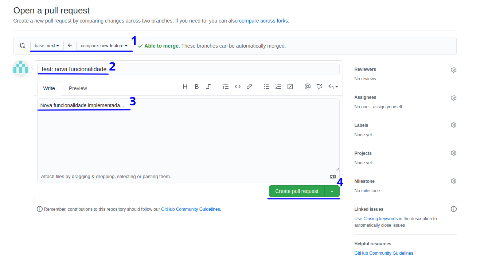

# Fluxo de trabalho no repositório
- [Fluxo de trabalho no repositório](#fluxo-de-trabalho-no-repositório)
  - [Pré requisito](#pré-requisito)
  - [Fluxo](#fluxo)
    - [1 - Baixe o repositório na sua máquina](#1---baixe-o-repositório-na-sua-máquina)
    - [2 - Crie uma branch a partir da branch `next`](#2---crie-uma-branch-a-partir-da-branch-next)
    - [3 - Faça o seu trabalho e crie um `commit` com as mudanças sempre que possível](#3---faça-o-seu-trabalho-e-crie-um-commit-com-as-mudanças-sempre-que-possível)
    - [4 - Terminou? Agora é a hora de criar uma *pull request* para a *branch* `next`](#4---terminou-agora-é-a-hora-de-criar-uma-pull-request-para-a-branch-next)
    - [5 - Chame o time para revisar a tarefa](#5---chame-o-time-para-revisar-a-tarefa)
    - [6 - Depois de aprovada a *pull request*, é hora de incluir ela para a `next`!](#6---depois-de-aprovada-a-pull-request-é-hora-de-incluir-ela-para-a-next)
## Pré requisito

Este guia segue o fluxo para a utilização via terminal e para isso você precisa [instalar o git na sua máquina](https://git-scm.com/book/en/v2/Getting-Started-Installing-Git). 
Este guia segue o fluxo para a utilização via terminal e para isso você precisa   instalar o git na sua máquina. 

Se você prefere utilizar uma interface gráfica, siga o [tutorial Fluxo de trabalho no repositório - interface gráfica](./docs/CONTRIBUTING_INTERFACE.md).

## Fluxo

### 1 - Baixe o repositório na sua máquina

```shell
git clone https://github.com/po-ds/pods-design.git
```

### 2 - Crie uma branch a partir da branch `next`

> Certifique-se de que você se encontra no diretório do repositório. Isso pode ser feito digitando o comando: `pwd` e veja se no resultado mostra que você está no repositório.

Garanta que o seu repositório local esteja atualizado da seguinte forma:

```
git pull 
```

Depois, entre na branch `next`:

```
git checkout next
```

Crie uma nova branch:

```
git checkout -b <nova-branch>
```

Dessa forma, uma nova branch será criada a partir da `next`.

### 3 - Faça o seu trabalho e crie um `commit` com as mudanças sempre que possível

Adicione todas as mudanças para o *stage*, dessa forma tudo que o estiver no *stage*, será adicionado no próximo *commit*. 

```
git add .
```

Crie o commit das alterações:

```
git commit -m "minha mensagem de commit"
```

Envie seu commit para o repositório remoto:

```
git push
```

Se for a primeira vez que você estiver fazendo o `git push` com essa *branch*, pode ser necessário adicionar o seguinte trecho no comando:

```
git push --set-upstream origin <nova-branch>
```

### 4 - Terminou? Agora é a hora de criar uma *pull request* para a *branch* `next`

Entre na página de [pull requests do PODS](https://github.com/po-ds/pods-design/pulls). E clique no botão escrito "New pull request", conforme a imagem abaixo.


Depois você precisa configurar a *pull request*, da seguinte maneira:

1. Escolha a branch `next` como *base* e a sua *branch* atual como *compare*. 

2. Adicione o título da *pull request*.

3. Adicione uma descrição. E direcione nesta descrição o que precisa ser revisado e como isso pode ser feito.

4. Clique no botão "Create pull request" para criar a pull request.


### 5 - Chame o time para revisar a tarefa

Nesse momento, compartilhe o link da sua *pull request* com as pessoas responsáveis por revisar.
Nesta revisão, essas pessoas poderão: aprovar, requisitar mudanças ou apenas comentar.
Para isso o Github tem uma documentação que explica [como aprovar pull requests](https://docs.github.com/en/github/collaborating-with-issues-and-pull-requests/approving-a-pull-request-with-required-reviews).

### 6 - Depois de aprovada a *pull request*, é hora de incluir ela para a `next`!

Neste momento, você precisa alterar a opção "Merge pull request" para "Squash and merge". 


Esta opção faz com que você resuma todos os *commits* da sua *pull request* em um único *commit*. Com isso irá abrir uma opção para você editar as mensagens de *commit*. 


> Utilizar as regras de [descrição do commit descritas no Notion](https://www.notion.so/Conven-o-de-mensagens-de-commit-para-design-df19f55c6e6e48778d4a715ed70d23f1).
